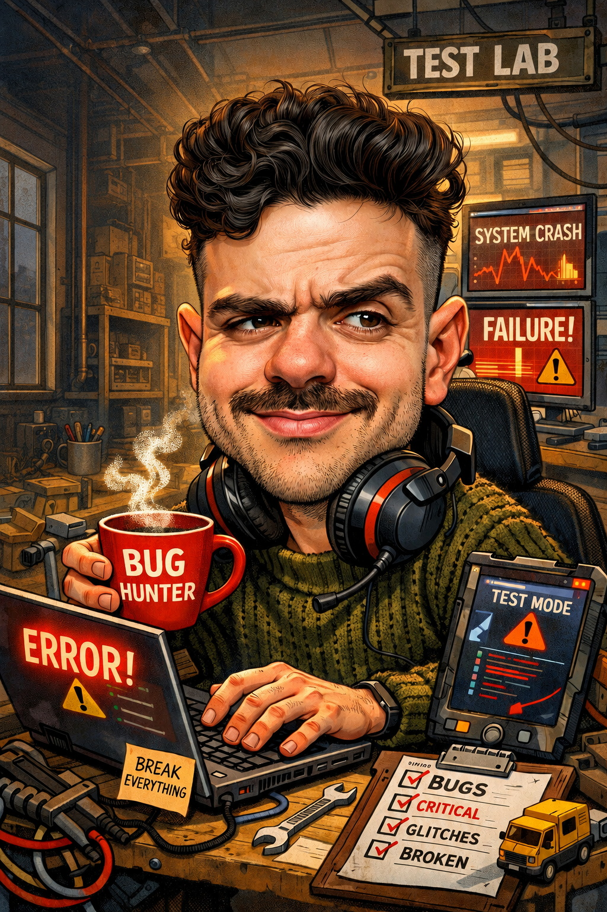
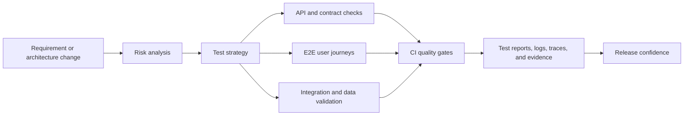

  

<h1 align="center">Rafa Pimentel</h1>
<h3 align="center">Quality Engineering | Test Automation | AI-assisted QA Workflows</h3>

  
  
  
  

---

## About me

I am a QA / Quality Engineer focused on building practical quality signals: test automation, risk-based test design, CI quality gates, and AI-assisted workflows that help teams find problems earlier.

My main interest is not just "writing automated tests". It is engineering a testing system that gives useful feedback before defects reach production.

Currently focused on:

- Shift-left testing from requirements and architecture discussions.
- Web, API, integration, and regression test automation.
- CI/CD quality gates, reports, logs, and reproducible test evidence.
- LLM/Codex-assisted QA workflows for ticket analysis, risk mapping, and test design.
- Building a public portfolio that proves technical QA skills through code, not just job titles.

---

## Quality engineering map

---

## Public work

| Project | What it demonstrates | Stack |
|---|---|---|
| [Oraculum / nabucodonosor](https://github.com/RaafaPimentel/nabucodonosor) | Full-stack technology intelligence dashboard with RSS ingestion, ranking, Supabase persistence, admin flow, security notes, and agent-based project structure. | Next.js, TypeScript, Tailwind CSS, Supabase, PostgreSQL, Vercel |
| [kabug-rb](https://github.com/RaafaPimentel/kabug-rb) | BDD-style web test automation lab using Cucumber and Capybara, with Docker/Jenkins pipeline elements. | Ruby, Cucumber, Capybara, Gherkin, Docker, Jenkins |

> Next portfolio targets: Playwright E2E automation, API contract testing, CI quality gates, and a sanitized AI-assisted QA agents workspace.

---

## Technical toolbox

### Test engineering

`Test Automation` `Shift-left Testing` `Risk-based Testing` `Regression Testing` `API Testing` `E2E Testing` `BDD` `Test Strategy` `Bug Analysis` `Quality Gates`

### Automation and development

`TypeScript` `JavaScript` `Python` `Ruby` `Gherkin` `Next.js` `Node.js` `Supabase` `PostgreSQL` `Docker`

### Tools and workflow

`Git` `GitHub` `GitHub Actions` `Jenkins` `Vercel` `Codex CLI` `LLM Agents` `CI/CD` `Markdown Documentation`

---

## How I think about testing

Good QA is not a person clicking through the same scenarios forever.

Good QA is the person who can look at a requirement, architecture decision, API contract, deployment flow, or production risk and ask:

- What can break here?
- How would we detect it early?
- What should be automated?
- What should not be automated?
- What evidence do we need to trust the release?
- How do we keep feedback fast, stable, and useful?

That is the type of quality engineering I am building toward.

---

## GitHub activity

  
  

---

## Current portfolio roadmap

- [x] Publish full-stack TypeScript project with real architecture documentation.
- [x] Publish BDD automation lab with Cucumber/Capybara.
- [ ] Publish Playwright E2E automation lab with reports, traces, fixtures, and CI.
- [ ] Publish API testing lab with contract/schema validation and negative scenarios.
- [ ] Publish sanitized AI-assisted QA agents examples for ticket review and test design.
- [ ] Add CI badges and test reports to each portfolio repository.

---

## Contact

- GitHub: [@RaafaPimentel](https://github.com/RaafaPimentel)
- LinkedIn: https://www.linkedin.com/in/rafaelferreira01/
